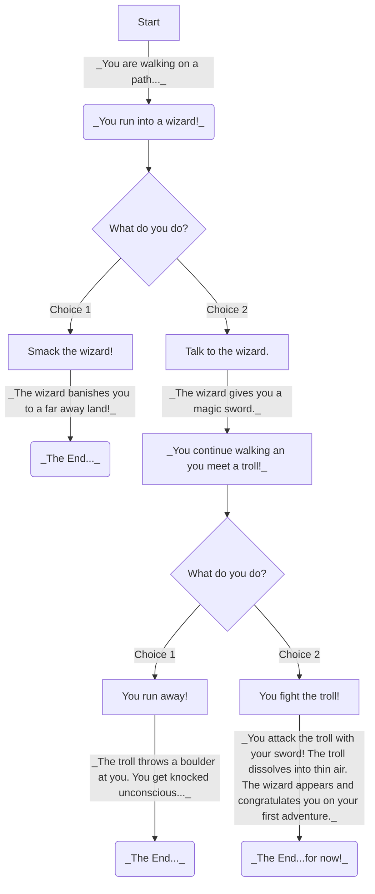

# Choose your own adventure diagram

## Description of diagram
>
>**A:** This is the start of the adventure.
>
>**B:** This is the first scenario where you meet a wizard!
>
>**C:** You are given two choices for interacting with the wizard.
>
>**D:** This choice is where you smack the wizard, ending the adventure.
>
>**E:** This option is where you talk to the wizard, continuing the adventure to the next scenario.
>
>**G:** This is the second scenario in the adventure where you meet a troll!
>
>**H:** You are given two choices for interacting with the troll.
>
>**I:** This choice is where you run away from the troll, ending the adventure.
>
>**J** This choice is where you fight the troll and are congratulated by the wizard. This ends the adventure.

_Note: The letters that are not listed (F, K, and L) are where the adventure ends._
